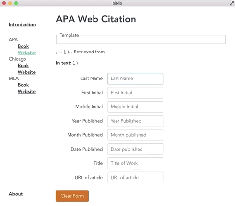

# Biblio

A desktop app to create bibliography citations.

Just fill in the fields and then click on the completed citations!

## Installation

1) Download the .dmg file from the releases folder
2) Open it up and drag it to your Applications folder

If you get an error about the program being unsigned, allow the app from:
+ System Preferences > Security & Privacy > General

Download or clone the repo, then run "npm run electron:serve" in the directory to build and launch the program in developer mode.

## Built With

* [Vue CLI 3](https://cli.vuejs.org/)- Command line tool for scaffolding the initial Vue project
* [Electron](https://electronjs.org/) - Dependency Management
* [vue-cli-plugin-electron-builder](https://github.com/nklayman/vue-cli-plugin-electron-builder) - Scaffolding Electron in Biblio
* [PureCSS](https://purecss.io/) - some CSS formatting

## Authors

* **Joshua Manuel** - *Initial work* - [JoshuaManuel](https://github.com/JoshuaManuel)

## License

I haven't decided on which license to release this code under yet, but I'll update the project with it later.
